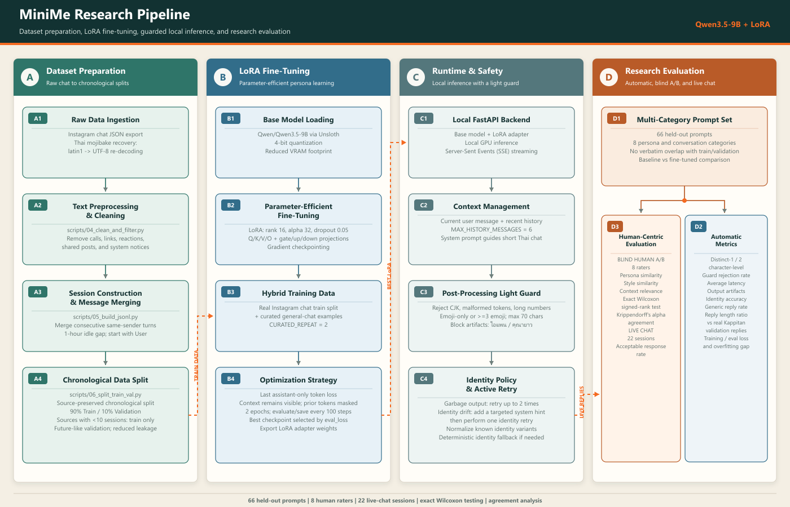

# MiniMe: Thai Persona Chatbot with Qwen3.5-9B + LoRA

MiniMe คือเว็บแชทภาษาไทยแบบ local ที่ fine-tune `Qwen/Qwen3.5-9B` ด้วย LoRA/Unsloth เพื่อให้ตอบสั้นและมีสไตล์ใกล้ "กัปปิตัน"

ระบบปัจจุบันให้โมเดลเป็นผู้สร้างคำตอบหลัก ไม่มี RAG และไม่มี fallback ทั่วไป มีเพียง light guard สำหรับกัน output ที่เสีย และ identity normalize/retry สำหรับคำถามเรื่องชื่อหรือตัวตน

โปรเจกต์นี้เป็นงานวิจัยเชิงวิศวกรรมแบบ end-to-end ตั้งแต่การแปลงประวัติข้อความแชทที่ export จาก Instagram เป็น conversational dataset, ออกแบบ last-assistant-only loss, fine-tune โมเดล 9B แบบ 4-bit LoRA, สร้าง FastAPI runtime และเว็บแชท ไปจนถึงการประเมิน baseline เทียบ fine-tuned model ด้วยผู้ประเมินจริง

## ผลลัพธ์เด่น

| ตัวชี้วัด | Fine-tuned | Baseline |
| --- | ---: | ---: |
| Captain Similarity (1-5) | **3.95** | 2.28 |
| Persona Consistency (1-5) | **3.90** | 1.87 |
| Style Similarity (1-5) | **3.99** | 2.11 |
| Relevance (1-5) | **3.99** | 3.49 |
| Reply-length ratio เทียบข้อมูลจริง | **1.0097** | 2.8018 |
| Guard rejection rate | **1.52%** | 12.12% |

- ชุดทดสอบ 66 prompts ใน 8 หมวด และผู้ประเมิน blind A/B จำนวน 8 คน
- Persona, style และ relevance ดีขึ้นอย่างมีนัยสำคัญ (`p < 0.0001`)
- Live chat 22 sessions รวม 277 prompts มี acceptable responses `66.79%`
- รายงานข้อจำกัดตรงไปตรงมา: context consistency ยังไม่ต่างจาก baseline อย่างมีนัยสำคัญ และ loss มีสัญญาณ overfitting ช่วงท้าย

## สิ่งที่โปรเจกต์นี้แสดง

- ออกแบบ data pipeline สำหรับข้อมูลแชทภาษาไทยและแก้ mojibake จาก Instagram export
- แบ่ง train/validation แบบ source-preserved chronological split เพื่อลด temporal leakage
- สร้าง LoRA training pipeline พร้อม custom chat template และ token-level label masking
- ออกแบบ runtime guard/retry โดยให้โมเดลเป็นผู้ตอบหลักแทนการพึ่ง fallback
- พัฒนา FastAPI, SSE และ responsive frontend ที่เก็บประวัติใน browser
- สร้าง evaluation framework ทั้ง automatic metrics, blind human A/B, agreement และ statistical testing
- จัดการ privacy โดยไม่เผยแพร่ raw chat, model weights, raw responses หรือคะแนนรายบุคคล



รายละเอียดเชิงเทคนิคฉบับเต็มอยู่ใน [PROJECT_OVERVIEW.md](PROJECT_OVERVIEW.md) และผลทดลองล่าสุดอยู่ใน [final evaluation summary](reports/evaluation/20260616-141015/final_evaluation_summary.md)

> MiniMe เป็น research prototype ที่ผ่านการประเมินผล ไม่ใช่ production chatbot ข้อมูลส่วนตัวและ model adapter ไม่รวมอยู่ใน public repository

## สถานะปัจจุบัน

| รายการ | ค่า |
| --- | --- |
| Base model | `Qwen/Qwen3.5-9B` |
| Main adapter | `output/captain-lora` |
| Fine-tuning | LoRA, 4-bit loading, last-assistant-only loss |
| Runtime | LoRA-only |
| Guard | light |
| Identity policy | `normalize` + retry |
| RAG | ไม่มี |
| General fallback | ไม่มี |
| Chat history | browser `localStorage` |

## การทำงานของระบบ

```text
Raw Instagram chat export
-> clean/filter
-> source-preserved train/validation split
-> LoRA fine-tuning
-> local FastAPI server
-> model generation
-> text cleanup + light guard + identity retry
-> web chat response
```

## โครงสร้างโปรเจกต์

```text
MiniMe/
|- data/
|  |- raw_data/                  Instagram chat export
|  |- filtered/                  ข้อมูลหลัง clean
|  |- output/
|  |  |- base_data.jsonl
|  |  |- train.jsonl
|  |  `- val.jsonl
|  `- curated/
|     |- general_chat_train.jsonl
|     `- general_chat_val.jsonl
|- evaluation/                   evaluation framework
|- diagrams/                     research architecture และไฟล์ renderer
|- minime_core/
|  |- runtime_env.py
|  |- text_cleaning.py
|  `- topic_guard.py
|- scripts/                      data pipeline และ server helpers
|- training/
|  `- train.py
|- web_app/
|  |- server.py
|  `- static/
|- output/
|  `- captain-lora/              adapter หลัก
|- reports/
|  |- training/
|  `- evaluation/
|- package.json                  Node dependency สำหรับ render diagrams
|- pnpm-lock.yaml                lockfile ของ Sharp renderer
|- requirements.txt
`- README.md
```

## ติดตั้ง

แนะนำ Python 3.11 บน Windows และ GPU ที่รองรับ CUDA

```powershell
python -m venv captain-env
captain-env\Scripts\Activate.ps1
python -m pip install --upgrade pip
python -m pip install -r requirements.txt
```

ตรวจว่า PyTorch เห็น GPU:

```powershell
captain-env\Scripts\python.exe -c "import torch; print(torch.cuda.is_available()); print(torch.cuda.get_device_name(0) if torch.cuda.is_available() else 'CPU')"
```

เรนเดอร์ research pipeline diagram ใหม่ด้วย Node.js 20 ขึ้นไป:

```powershell
pnpm install
pnpm run render:research-pipeline
```

## Dataset Pipeline

ลำดับที่แนะนำสำหรับ rebuild `train.jsonl` และ `val.jsonl`:

```powershell
captain-env\Scripts\python.exe scripts\01_delete_media.py
captain-env\Scripts\python.exe scripts\04_clean_and_filter.py
captain-env\Scripts\python.exe scripts\05_build_jsonl.py
captain-env\Scripts\python.exe scripts\06_split_train_val.py
```

กรณี raw export ยังไม่ได้ rename/flatten สามารถใช้ขั้นตอนเสริม:

```powershell
captain-env\Scripts\python.exe scripts\01_delete_media.py
captain-env\Scripts\python.exe scripts\02_rename_json.py --apply
captain-env\Scripts\python.exe scripts\03_flatten_inbox.py --apply
captain-env\Scripts\python.exe scripts\04_clean_and_filter.py
captain-env\Scripts\python.exe scripts\05_build_jsonl.py
captain-env\Scripts\python.exe scripts\06_split_train_val.py
```

| ขั้นตอน | ไฟล์ | หน้าที่ |
| ---: | --- | --- |
| 01 | `scripts/01_delete_media.py` | ลบ media folders ที่ไม่ใช้ train |
| 02 | `scripts/02_rename_json.py` | optional rename; preview ก่อนจนกว่าจะใส่ `--apply` |
| 03 | `scripts/03_flatten_inbox.py` | optional flatten; preview ก่อนจนกว่าจะใส่ `--apply` |
| 04 | `scripts/04_clean_and_filter.py` | clean ข้อความและตัด conversation ที่ใช้ไม่ได้ |
| 05 | `scripts/05_build_jsonl.py` | สร้าง `base_data.jsonl` พร้อม `source` |
| 06 | `scripts/06_split_train_val.py` | แบ่ง train/validation แบบ source-preserved 90/10 |

Emotion tagging และ romantic filter ถูกถอดออกจาก pipeline แล้ว

## Training Data

| ไฟล์ | การใช้งาน |
| --- | --- |
| `data/output/train.jsonl` | raw chat train sessions |
| `data/output/val.jsonl` | raw chat validation sessions |
| `data/curated/general_chat_train.jsonl` | ตัวอย่างควบคุมแนวตอบทั่วไป |
| `data/curated/general_chat_val.jsonl` | curated validation examples |

`source` ใช้สำหรับรักษาที่มาของ session ตอน split แต่ไม่มี source balancing ใน training ปัจจุบัน

## Training Configuration

ค่าหลักใน `training/train.py`:

| Parameter | Value |
| --- | ---: |
| `MAX_SEQ_LEN` | 2048 |
| `MAX_CONTEXT_TURNS` | 8 |
| `MAX_COMPLETION_CHARS` | 60 |
| `CURATED_REPEAT` | 2 |
| `TRAIN_EPOCHS` | 2 |
| `EVAL_STEPS` | 100 |
| `SAVE_STEPS` | 100 |
| `SAVE_TOTAL_LIMIT` | 10 |
| LoRA rank / alpha / dropout | 16 / 32 / 0.05 |
| Label mode | last assistant only |
| Best-model metric | `eval_loss` |

ตรวจข้อมูลโดยไม่โหลดโมเดล:

```powershell
captain-env\Scripts\python.exe training\train.py --data-check-only
```

Train candidate ใหม่:

```powershell
$env:MINIME_BASE_MODEL="Qwen/Qwen3.5-9B"
$env:MINIME_OUTPUT_DIR="output/candidates/captain-lora-next"
captain-env\Scripts\python.exe training\train.py
```

หากต้อง overwrite candidate ที่อนุญาต:

```powershell
$env:MINIME_OVERWRITE_OUTPUT="1"
captain-env\Scripts\python.exe training\train.py
```

`training/train.py` ป้องกันไม่ให้เขียนทับ `output/captain-lora` และ `output/captain-lora-candidate` โดยตรง ผล training และ loss history จะถูกเขียนใน `reports/training/`

## Start Server

คำสั่งที่แนะนำ:

```powershell
powershell -NoProfile -ExecutionPolicy Bypass -File scripts\run_server.ps1
```

ระบุ adapter, identity policy หรือ port:

```powershell
powershell -NoProfile -ExecutionPolicy Bypass -File scripts\run_server.ps1 `
  -AdapterPath output\captain-lora `
  -IdentityPolicy normalize `
  -Port 8000
```

เปิด `http://127.0.0.1:8000`

เรียก Uvicorn โดยตรงได้เช่นกัน แต่ต้องตั้ง environment เอง:

```powershell
$env:MINIME_ADAPTER_PATH="output\captain-lora"
$env:MINIME_IDENTITY_POLICY="normalize"
captain-env\Scripts\python.exe -m uvicorn web_app.server:app --host 127.0.0.1 --port 8000
```

`run_server.ps1` ช่วยตั้ง UTF-8, adapter path, identity policy และ access key ให้ครบก่อนเรียก Uvicorn

## Public Testing

เปิด server และ Cloudflare quick tunnel:

```powershell
powershell -NoProfile -ExecutionPolicy Bypass -File scripts\run_public_tunnel.ps1 -DownloadCloudflared
```

รัน tunnel เบื้องหลัง:

```powershell
powershell -NoProfile -ExecutionPolicy Bypass -File scripts\run_public_tunnel.ps1 -DownloadCloudflared -Background
```

หยุด public tunnel:

```powershell
powershell -NoProfile -ExecutionPolicy Bypass -File scripts\stop_public_tunnel.ps1
```

ตั้ง access key สำหรับ local server:

```powershell
powershell -NoProfile -ExecutionPolicy Bypass -File scripts\run_server.ps1 -AccessKey "friend-test"
```

แล้วเปิด `http://127.0.0.1:8000/?key=friend-test`

Public URL ใช้งานได้เฉพาะตอนเครื่องและ server ยังเปิดอยู่ ผู้ที่มี URL และ key สามารถใช้ GPU ของเครื่องนี้ได้ จึงควรเก็บ key เป็นความลับ

## Runtime Behavior

```text
User message
-> system prompt + recent history สูงสุด 6 messages
-> LoRA model generate
-> clean_generated_reply()
-> light guard
-> identity normalize/retry เมื่อจำเป็น
-> stream reply ผ่าน SSE
```

Light guard กันเฉพาะ output ที่เสียชัดเจน เช่น:

- empty reply
- replacement character `U+FFFD`
- CJK/Chinese output
- known bad tokens เช่น `kappitton`, `captain`, `ไอแพน`, `คูณายาว`
- app/package-like strings
- digit runs ที่ยาวผิดปกติ
- emoji-only หรือ emoji spam
- bracket tags
- reply ที่ยาวเกิน `MAX_REPLY_CHARS`

Guard ไม่ block topic หรือสถานที่ทั่วไปแบบกว้าง เพราะจะทำให้โมเดลตอบปลอดภัยเกินไปและเสียธรรมชาติของบทสนทนา

## Evaluation Framework

Evaluation แยกจาก training pipeline และใช้เพื่อวัดงานวิจัย ไม่ใช่รับรอง production readiness

### Prompt Set

`evaluation/prompts.jsonl` มี 66 prompts, 8 categories และผ่านการตรวจว่าไม่ซ้ำ train/validation แบบ verbatim

| Category | Count |
| --- | ---: |
| `identity` | 5 |
| `bot_identity` | 3 |
| `greeting` | 10 |
| `food_game_travel` | 13 |
| `emotion_support` | 7 |
| `privacy_status` | 2 |
| `open_ended` | 11 |
| `multi_turn` | 15 |

ตรวจ prompt set:

```powershell
captain-env\Scripts\python.exe evaluation\check_prompts.py
```

### Generate Baseline and Fine-tuned Responses

```powershell
captain-env\Scripts\python.exe evaluation\generate_responses.py `
  --adapter output\captain-lora `
  --label finetuned
```

```powershell
captain-env\Scripts\python.exe evaluation\generate_responses.py `
  --base-only `
  --label baseline `
  --run-dir <RUN_DIR>
```

### Automatic Metrics

```powershell
captain-env\Scripts\python.exe evaluation\compute_metrics.py --run-dir <RUN_DIR>
```

Automatic metrics ประกอบด้วย:

- guard rejection rate
- average/median reply length
- reply-length ratio เทียบคำตอบจริงใน raw validation
- long-reply rate
- output artifact, emoji spam, CJK และ bad-token rates
- identity accuracy/retry rate
- generic reply rate สำหรับ open-ended prompts
- character-level Distinct-1/Distinct-2
- average latency
- training/eval loss และ overfitting gap

### Blind Human A/B Evaluation

เตรียมไฟล์ blind:

```powershell
captain-env\Scripts\python.exe evaluation\prepare_human_eval.py --run-dir <RUN_DIR>
```

แจกเฉพาะ:

- `human_eval_blind.csv`
- `human_eval_rubric.txt`
- `human_eval_instructions.md`

ห้ามแจก `human_eval_mapping_private.txt` ก่อนประเมินเสร็จ เพราะเป็นเฉลย A/B

วิเคราะห์คะแนน:

```powershell
captain-env\Scripts\python.exe evaluation\analyze_human_eval.py `
  --run-dir <RUN_DIR> `
  --labels finetuned baseline `
  --eval-csvs <RATER_1.csv> <RATER_2.csv> <RATER_3.csv>
```

Human metrics:

- Persona Consistency
- Style Similarity
- Relevance
- Context Consistency สำหรับ multi-turn
- Captain Similarity Score = `0.45 * persona + 0.35 * style + 0.20 * relevance`
- Quadratic Weighted Kappa และ interval-distance Krippendorff's Alpha
- exact Wilcoxon sign-permutation p-value และ rank-biserial effect size

### Live Chat Evaluation

```powershell
captain-env\Scripts\python.exe evaluation\analyze_live_chat.py `
  --run-dir <RUN_DIR> `
  --eval-csvs <LIVE_CHAT_RESULTS.csv>
```

Live-chat metrics:

- Captain similarity
- Context following
- Problem level
- acceptable/unacceptable response counts และ rates
- ค่าเฉลี่ยต่อ evaluator เพื่อไม่ให้คนที่มีหลาย sessions มีน้ำหนักมากเกินไป

Live chat เป็น descriptive evaluation ของ fine-tuned model ปัจจุบัน ไม่ได้เปรียบเทียบ baseline และไม่ควรรายงาน inter-rater agreement หากผู้ประเมินคุยคนละบทสนทนา

## ผลการประเมินล่าสุด

Run: `reports/evaluation/20260616-141015`

### Human Blind A/B

| Metric | Fine-tuned | Baseline |
| --- | ---: | ---: |
| Captain Similarity | 3.95 | 2.28 |
| Persona Consistency | 3.90 | 1.87 |
| Style Similarity | 3.99 | 2.11 |
| Relevance | 3.99 | 3.49 |
| Context Consistency | 4.73 | 4.62 |

Persona, style และ relevance แตกต่างอย่างมีนัยสำคัญ (`p < 0.0001`) ส่วน context ยังไม่ต่างอย่างมีนัยสำคัญ (`p = 0.1328`)

### Live Chat

- 8 evaluators
- 22 sessions
- 277 user prompts และทุกคนอย่างน้อย 30 prompts
- Captain similarity: `3.33/5`
- Context following: `3.44/5`
- Problem level: `2.85/5` โดยค่าต่ำกว่าแปลว่าดีกว่า
- Acceptable: `185/277` หรือ `66.79%`

### Reply Length

คำตอบจริงใน raw validation หลัง training filters และไม่รวม curated จำนวน 437 คำตอบ มีความยาวเฉลี่ย `15.85` ตัวอักษร

| Model | Mean chars | Ratio to real reference |
| --- | ---: | ---: |
| Fine-tuned | 16.0 | 1.0097 |
| Baseline | 44.4 | 2.8018 |

### Training and Validation Loss

- Best checkpoint: `checkpoint-900`
- Best eval/validation loss: `3.3519`
- Gap เริ่มเกิน 1.0 ที่ step 700
- Maximum matched gap: `1.2167` ที่ step 800


ผลแสดงว่า fine-tuning ทำให้ persona และ style ใกล้กัปปิตันขึ้นชัดเจน แต่ live chat ยังมีคำตอบที่ยอมรับไม่ได้ประมาณหนึ่งในสาม และ loss มีสัญญาณ overfitting ในช่วงท้าย

## Libraries

รายการเต็มและ version ที่ใช้จริงอยู่ใน `requirements.txt`

| กลุ่ม | Libraries |
| --- | --- |
| Fine-tuning | Unsloth, Transformers, Datasets, TRL, PEFT, Accelerate |
| Model/runtime | PyTorch, bitsandbytes, safetensors, tokenizers, sentencepiece |
| Data backend | NumPy, PyArrow, fsspec |
| Web | FastAPI, Uvicorn, Pydantic |
| Frontend | HTML, CSS, JavaScript, Server-Sent Events |

เวอร์ชันหลักของ local stack:

| Library | Version |
| --- | ---: |
| Python | 3.11.x recommended |
| Unsloth | 2026.5.10 |
| Transformers | 5.5.0 |
| Datasets | 4.3.0 |
| TRL | 0.23.0 |
| PEFT | 0.19.1 |
| PyTorch | 2.10.0+cu128 |
| FastAPI | 0.122.0 |
| Uvicorn | 0.38.0 |

## Important Files

| Path | Purpose |
| --- | --- |
| `training/train.py` | data filtering, tokenization และ LoRA training |
| `web_app/server.py` | FastAPI model server |
| `minime_core/text_cleaning.py` | shared text cleanup |
| `minime_core/topic_guard.py` | training/runtime guard rules |
| `scripts/run_server.ps1` | recommended local launcher |
| `evaluation/` | response generation และ evaluation scripts |
| `reports/training/` | training metrics |
| `reports/evaluation/` | automatic, human และ live-chat reports |

## Research Limitations

- โมเดลสร้าง persona เดียวจากข้อมูลของบุคคลเดียว
- prompt test set มี 66 prompts และผู้ประเมิน human A/B มี 8 คน
- A/B assignment สมดุลโดยรวมแต่ผู้ประเมินทุกคนใช้ order ชุดเดียวกัน
- agreement ระหว่างผู้ประเมินของ fine-tuned style/relevance ค่อนข้างต่ำ
- live chat ไม่มี baseline condition และไม่มี transcript ราย turn
- reply-length ratio เป็น corpus-level reference ไม่ใช่ paired reference ต่อ prompt
- training loss แยกจาก validation loss ชัดในช่วงท้าย จึงมีสัญญาณ overfitting

## Privacy

`data/` และ `output/` ถูก ignore จาก Git เพราะมีข้อมูลส่วนตัวและ model weights ห้ามเผยแพร่ raw chat, access key หรือ adapter โดยไม่ได้รับอนุญาต
