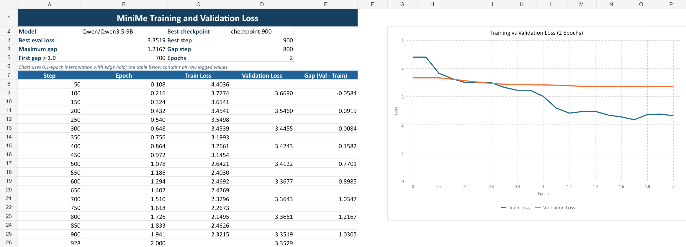

# สรุปผลการประเมิน MiniMe

Run: `20260616-141015`

## ขอบเขตการประเมิน

- Prompt จำนวน 66 ข้อ
- ผู้ประเมิน 8 คน
- เปรียบเทียบแบบ blind A/B ระหว่าง `baseline` และ `finetuned`
- คะแนน A/B ที่ส่งมาทั้งหมด 3,408 ช่อง ครบทุกช่อง และไม่มีการแทนค่าคะแนน
- คะแนน Captain Similarity คำนวณจาก `0.45 * persona + 0.35 * style + 0.20 * relevance`
- Live chat จำนวน 22 sessions จากผู้ประเมิน 8 คน รวม 277 user prompts โดยแต่ละคนส่งอย่างน้อย 30 prompts

## ผลหลักจากมนุษย์

| ตัวชี้วัด (1-5) | Fine-tuned | Baseline | ผลต่าง |
| --- | ---: | ---: | ---: |
| Captain Similarity | 3.95 | 2.28 | +1.67 |
| Persona Consistency | 3.90 | 1.87 | +2.03 |
| Style Similarity | 3.99 | 2.11 | +1.88 |
| Relevance | 3.99 | 3.49 | +0.50 |
| Context Consistency | 4.73 | 4.62 | +0.11 |

Fine-tuned ชนะเมื่อเทียบค่าเฉลี่ยราย prompt จำนวน 60/66 ข้อในด้านบุคลิก, 61/66 ข้อในด้านสไตล์ และ 44/66 ข้อในด้านความตรงคำถาม

## การทดสอบทางสถิติ

ใช้ Wilcoxon signed-rank แบบสองทาง พร้อม exact sign-permutation p-value โดยเฉลี่ยคะแนนผู้ประเมินในแต่ละ prompt ก่อน เพื่อให้ prompt เป็นหน่วยวิเคราะห์และไม่ถือว่าคะแนนจากคนเดียวกันเป็นข้อมูลอิสระหลายชุด

| ตัวชี้วัด | Rank-biserial r | p-value | สรุปที่ระดับ 0.05 |
| --- | ---: | ---: | --- |
| Persona Consistency | 0.9762 | <0.0001 | Fine-tuned แตกต่างอย่างมีนัยสำคัญ |
| Style Similarity | 0.9861 | <0.0001 | Fine-tuned แตกต่างอย่างมีนัยสำคัญ |
| Relevance | 0.5689 | <0.0001 | Fine-tuned แตกต่างอย่างมีนัยสำคัญ |
| Context Consistency | 0.5000 | 0.1328 | ยังไม่พบความแตกต่างอย่างมีนัยสำคัญ |

## ผลอัตโนมัติประกอบ

| ตัวชี้วัด | Fine-tuned | Baseline |
| --- | ---: | ---: |
| คำตอบผ่าน guard | 65/66 | 58/66 |
| Guard rejection rate | 1.52% | 12.12% |
| ความยาวเฉลี่ย | 16.0 ตัวอักษร | 44.4 ตัวอักษร |
| Length ratio เทียบคำตอบจริงเฉลี่ย 15.85 ตัวอักษร | 1.0097 | 2.8018 |
| Identity accuracy | 100% | 100% |
| Generic reply rate ใน open-ended prompts | 0% | 71.43% |
| เวลาเฉลี่ยต่อคำตอบ | 1,191.5 ms | 1,989.7 ms |

Fine-tuned ตอบสั้นกว่า ผ่าน guard มากกว่า และเร็วกว่าในชุดทดสอบนี้ ซึ่งสอดคล้องกับลักษณะการคุยสั้นแบบกัปปิตัน อย่างไรก็ตาม metric อัตโนมัติเป็นหลักฐานสนับสนุน ไม่ควรใช้แทนผลประเมินจากมนุษย์

Length ratio ใช้คำตอบกัปปิตันจริง 437 คำตอบจาก raw validation หลังผ่าน training filters และไม่รวม curated เป็น corpus-level reference ไม่ใช่คำตอบอ้างอิงแบบจับคู่กับแต่ละ test prompt

Training loss และ validation loss เริ่มแยกห่างเกิน 1.0 ที่ step 700 และมี gap สูงสุด `1.2167` ที่ step 800 จึงมีสัญญาณ overfitting แม้ checkpoint-900 จะมี eval loss ต่ำที่สุด

## ผลการสนทนาสด

คะแนนหลักคำนวณโดยเฉลี่ยแต่ละคนก่อน แล้วจึงเฉลี่ยผู้ประเมินทั้ง 8 คน เพื่อไม่ให้คนที่ทดสอบหลาย session มีน้ำหนักมากกว่า

| ตัวชี้วัด | ค่าเฉลี่ย ± SD |
| --- | ---: |
| Captain similarity (1-5) | 3.33 ± 0.98 |
| Context following (1-5) | 3.44 ± 1.01 |
| Problem level (1-5, ต่ำกว่าดีกว่า) | 2.85 ± 0.75 |

จากคำตอบทั้งหมด 277 ครั้ง ผู้ประเมินจัดเป็น acceptable 185 ครั้ง (`66.79%`) และ unacceptable 92 ครั้ง (`33.21%`) ส่วนค่า acceptable rate เมื่อให้น้ำหนักผู้ประเมินแต่ละคนเท่ากันอยู่ที่ `68.10% ± 19.30%`

ผลนี้แสดงว่าโมเดลคุยสดได้ในระดับยอมรับได้ประมาณสองในสามของคำตอบ แต่ยังมีปัญหาในการใช้งานจริงมากกว่าที่เห็นจาก fixed prompts

## ความน่าเชื่อถือและข้อจำกัด

- Weighted Kappa ของ fine-tuned อยู่ระดับ Fair สำหรับ persona (`0.2248`) และ context (`0.2554`) แต่ระดับ Slight สำหรับ style (`0.1602`) และ relevance (`0.1720`)
- Krippendorff's Alpha แบบ interval ของ fine-tuned ต่ำ: persona `0.1415`, style `0.0249`, relevance `0.0575` และ context `0.0238` แสดงว่าผู้ประเมินยังตีความ rubric ไม่ตรงกันมาก
- ผลด้าน persona และ style เด่นชัด แต่ผล context ยังไม่เพียงพอสำหรับกล่าวว่า fine-tuned ดีกว่า baseline
- มีผู้ประเมิน 8 คนและ prompt 66 ข้อ ผลนี้ใช้สรุปการทดลองชุดนี้ได้ แต่ไม่ควรอ้างแทนผู้ใช้ทุกกลุ่ม
- A/B ถูกสุ่มและสมดุลโดยรวม (`35/31`) แต่ผู้ประเมินทุกคนใช้ assignment ชุดเดียวกันและไม่ได้ balance แยกตาม category จึงยังแยก position bias ออกจาก category effect ไม่ได้สมบูรณ์
- Live chat ทดสอบเฉพาะโมเดล fine-tuned จึงใช้บอกคุณภาพการใช้งานจริงได้ แต่ใช้เปรียบเทียบกับ baseline โดยตรงไม่ได้
- ผู้ประเมินแต่ละคนทดสอบจำนวน sessions และ prompts ไม่เท่ากัน จึงรายงานทั้งค่าเฉลี่ยต่อผู้ประเมินและอัตรารวมต่อคำตอบ
- Live chat ไม่มี transcript ราย turn จึงตรวจสอบ acceptable/unacceptable ย้อนกลับทีละคำตอบไม่ได้

## ข้อสรุป

Fine-tuning ทำให้ MiniMe มีบุคลิกและสไตล์ใกล้กัปปิตันกว่า baseline อย่างชัดเจนและมีนัยสำคัญทางสถิติ ความตรงคำถามดีขึ้นเช่นกันแต่มีขนาดผลต่างน้อยกว่า ส่วนการรักษาบริบทใน blind A/B ยังไม่พบความแตกต่างอย่างมีนัยสำคัญ เมื่อทดสอบคุยสด โมเดลได้ Captain similarity `3.33/5` และมีคำตอบ acceptable `66.79%` จึงสรุปได้ว่าโมเดลมีบุคลิกใกล้กัปปิตันขึ้นจริง แต่คุณภาพการสนทนาต่อเนื่องยังอยู่ระดับปานกลางและยังมีพื้นที่ให้ปรับปรุง
